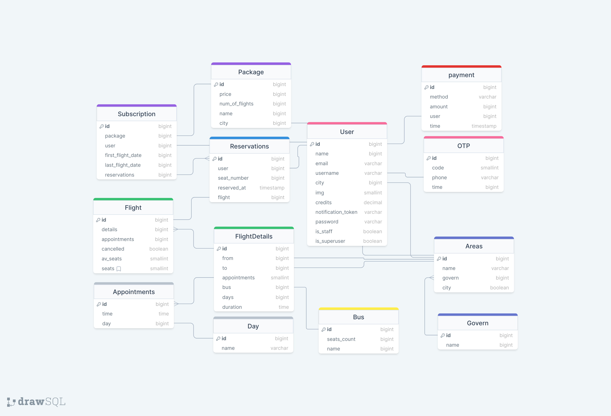
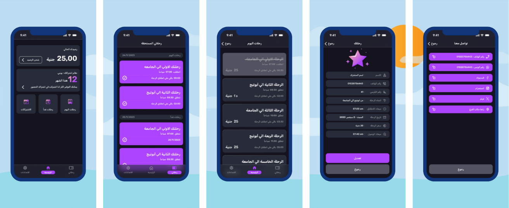
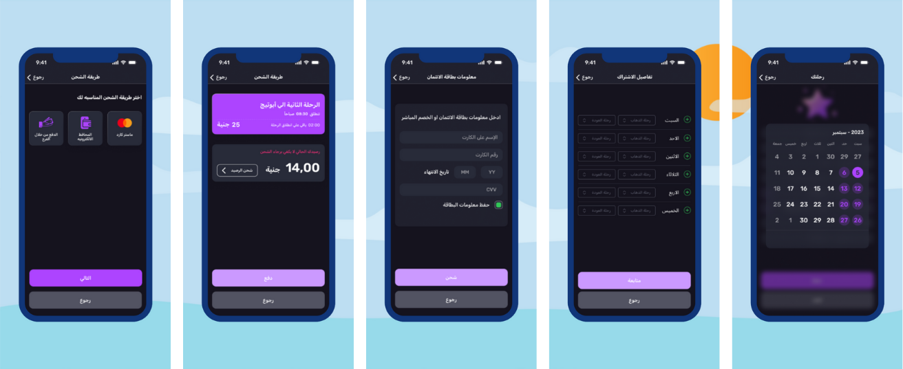
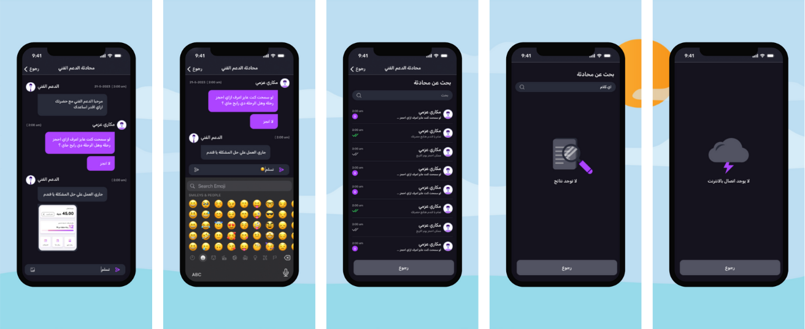
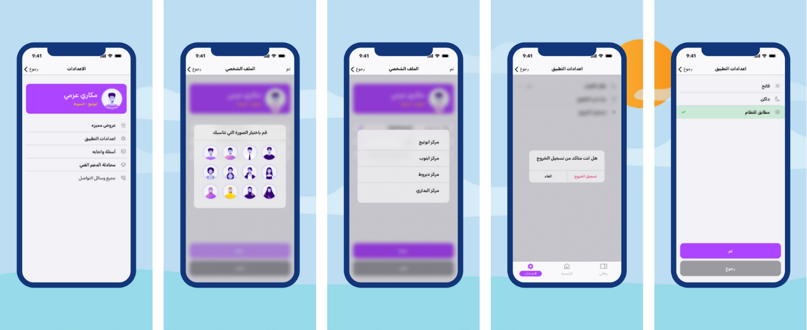

# Momyez

Real world booking app that offers authentication via phone verification and OTP
password reset, hassle-free booking flights with concurrency methods to avoid
over booking and convenient monthly subscriptions, customer support through
real-time chat with voice and image sharing, secure payments integrated with
Paymob, efficient static file hosting on Amazon S3, a robust backend built on
Django with PostgreSQL for reliable data storage, Redis for accelerated response
times, and responsive mapping, celery for background tasks as creating new
flights and sending notification before flights

# Key Features:

## Registration:

    Secure sign-up: Phone number verification with OTP.
    Comprehensive profile creation: Fields for name, email, location, and gender.
    Secure login: Phone number and password authentication.
    Password reset: OTP-based process for easy retrieval.

## Main User Functionality:

    Flight visibility: View today's and tomorrow's flight schedules.
    Easy reservations: Reserve flights with available seats.
    Subscription options: Purchase monthly subscriptions for frequent travelers.
    Reservation management: View ticket details and subscription information.
    Credit management: Add credits to accounts using various payment methods.

## Chat:
    A real-time chat using Django channels that offer sending messages, voice-notes and images.
    Static files stored in Amazon S3 using API-Getaway that enables fast uploading and retrive.

## Settings:

    Profile management: View and update personal information.
    FAQ access: Get answers to common questions.
    Special offers: Receive exclusive deals and discounts.
    Personalization: Switch between dark and light theme modes. 

# System Features

## Dynamic flight creation

    In system we can create appointment's, it's combination of day and time, this appointment can be linked to flights,
    every day there is a background worker that runs and create the new flights checking the linked appointment's and 
    dynamically creating the flight with each exisitng appointment.
    
## Sending notification before every flight

    The system usese celery background worker that get a heartbeat every 30 min, that background worker checks if there is a flight
    will move in next 30 min, if it's the system check all users reserved this flight and send notification to all users using Google FCM.

## Admin Chat
    Admin chat provides a websocekts that get all users new messages, in message sending there is a socket for each user
    that only the admin and user could connect to, in user sending message it got forward to the admin socket so all messages 
    could be accessed in one socket.

## Payment
    In payment there is an API endpoint that got called from the third party payment getaway, in that endpoint call 
    there is a securty check to make sure that call happend from the authorized end, the security check is made using
    hmac code check, so all payments are verified and secure.

# ERD

# App IMages
## Registration

## Main 1

## Main 2

## Chat

## Settings

### APK version can be downloaded from [APK](https://drive.google.com/file/d/1z-Dt57mTGP68NIGNCPpF2VQsk6TMJTq9/view?usp=sharing).
